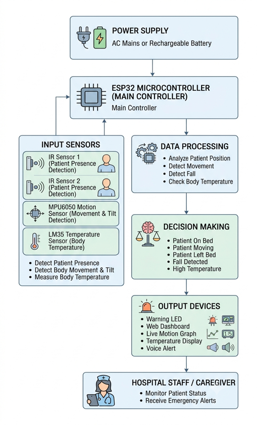
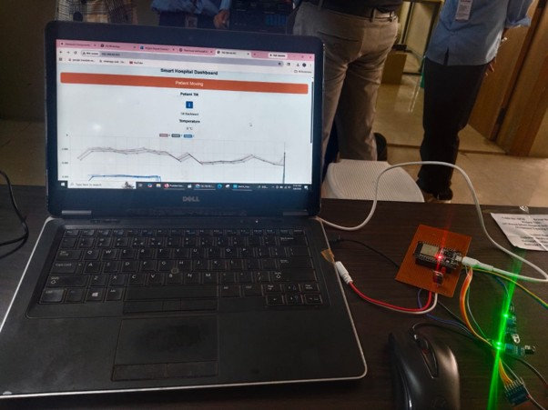
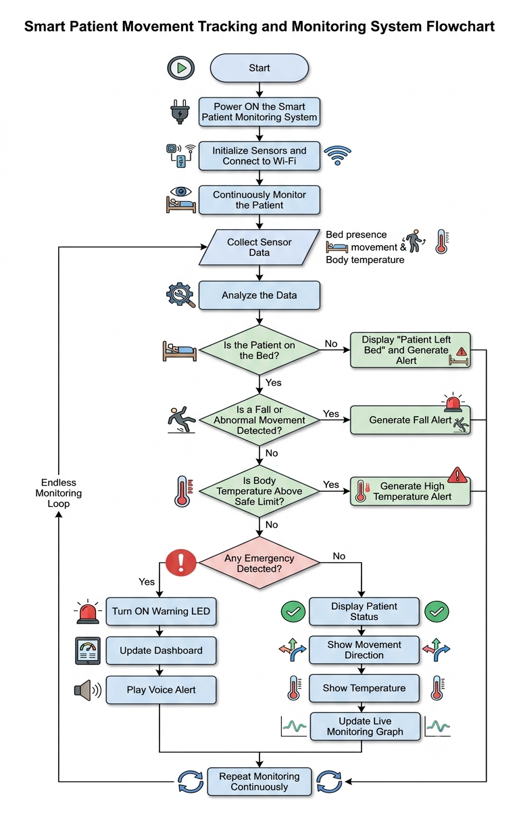

# IoT-Based Smart Hospital Bed and Patient Movement Tracking System

An IoT-based healthcare monitoring system designed to continuously monitor
patient presence, movement, body temperature, and emergency conditions
using an ESP32 microcontroller and multiple sensors.

## 📌 Project Overview

The system monitors a patient's condition in real time and displays the
information through a web-based dashboard.

The ESP32 collects data from the connected sensors, processes the readings,
detects patient movement, bed exit, fall conditions, and high temperature,
and provides emergency alerts through an LED and web dashboard.

## ✨ Features

- Patient presence detection
- Patient movement detection
- Bed exit detection
- Fall detection
- Body temperature monitoring
- Patient tilt direction detection
- Real-time web dashboard
- Live sensor data visualization
- Emergency LED alert
- Voice alerts for emergency conditions
- Wi-Fi-based communication

## 🔧 Hardware Components

- ESP32 Development Board
- IR Sensor Modules
- MPU6050 Accelerometer/Gyroscope
- LM35 Temperature Sensor
- LED
- Resistors
- Perfboard / PCB
- Jumper Wires

## 💻 Software & Technologies

- C/C++
- Arduino IDE
- ESP32
- HTML
- CSS
- JavaScript
- WebServer
- Wi-Fi
- Chart.js

## 🏗️ System Architecture

The ESP32 acts as the central controller of the system. It receives data
from the sensors, processes the readings, determines the patient's status,
and displays the information on a web dashboard.

### Block Diagram



## 🔄 Working

1. The ESP32 initializes the connected sensors.
2. The system connects to a Wi-Fi network.
3. IR sensors detect patient presence on the bed.
4. The MPU6050 monitors movement and tilt.
5. The LM35 measures body temperature.
6. The ESP32 processes the sensor data.
7. The processed information is displayed on the web dashboard.
8. Emergency conditions activate the warning LED.
9. The dashboard provides voice alerts for selected emergency conditions.

## 📊 Dashboard

The web dashboard displays:

- Patient status
- Movement status
- Tilt direction
- Body temperature
- Live movement graph
- Emergency alerts

### Dashboard Preview



## 🔬 Project Prototype




## 📁 Project Structure

```text
IoT-Smart-Hospital-Bed/
│
├── Code/
│   └── Project.ino
│
├── Images/
│   ├── block-diagram.png
│   ├── flowchart.png
│   ├── prototype.jpg
│   └── dashboard.jpg
│
├── Report/
│   └── Iot-Smart-Hospital-Bed.pdf
│
└── README.md
